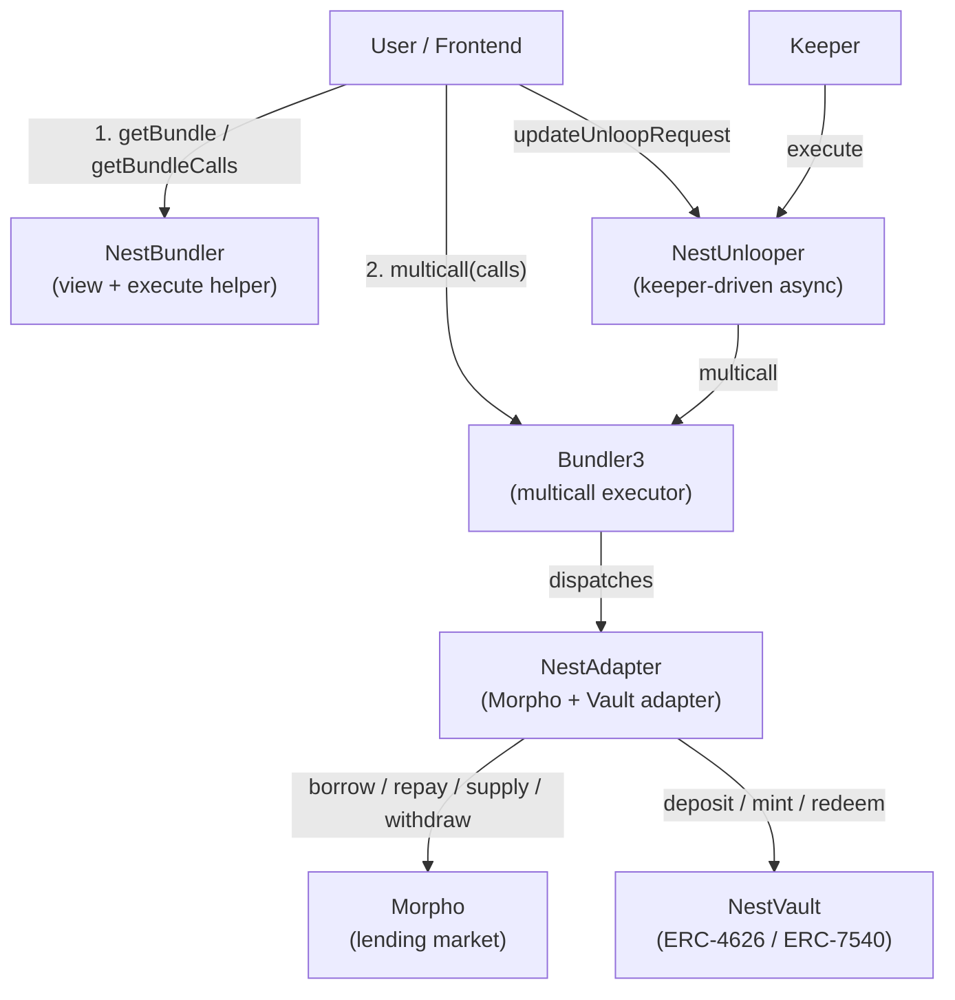
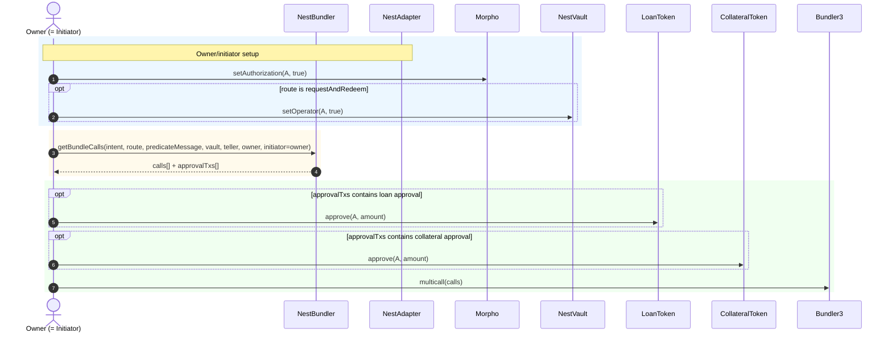
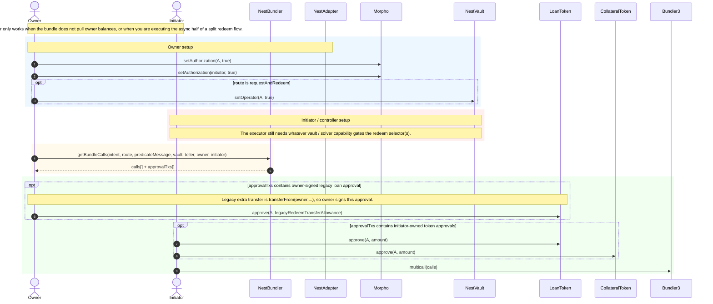
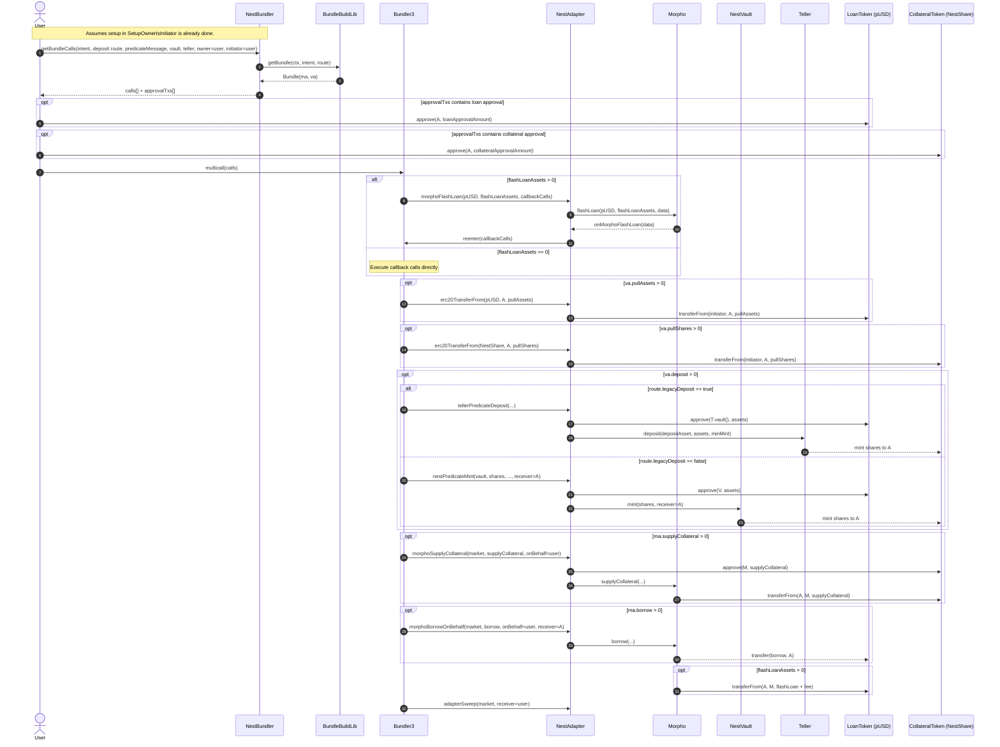
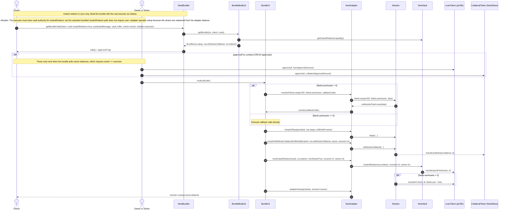
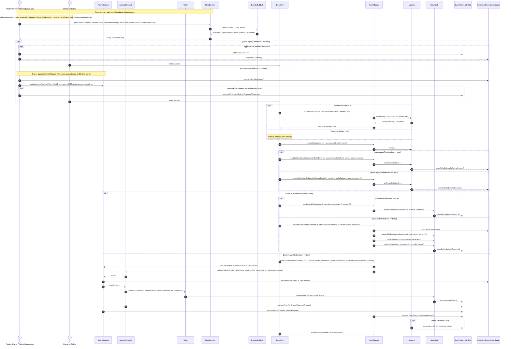
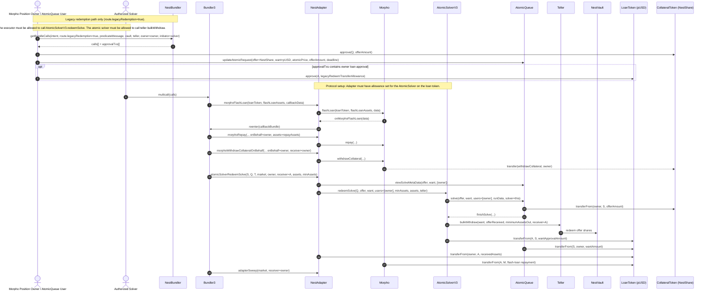
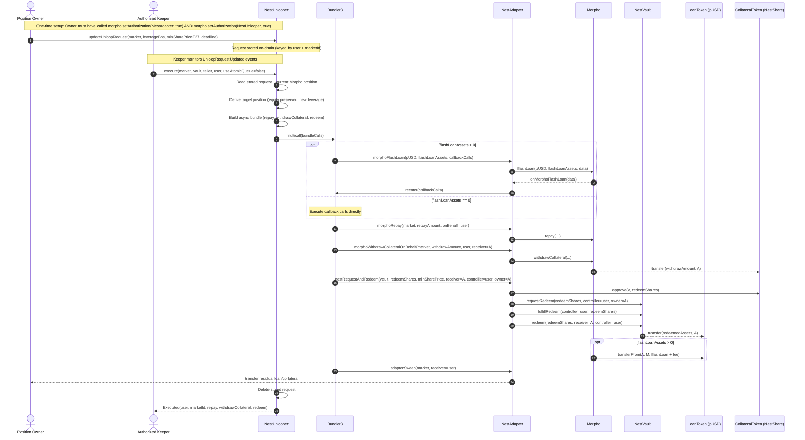

# Nest Bundler -- Integrator Guide

The Nest Bundler system lets users atomically build, modify, and unwind leveraged positions on Morpho markets using Nest vault shares as collateral. A user only needs to know their **current position** and express their **target leverage** -- the bundler derives every intermediate action (borrow, repay, mint, redeem, supply, withdraw) and packages them into a single multicall.

The key insight: the Morpho market's **collateral token is the Nest vault's share token** (e.g. `nALPHA`). This is what makes the leverage loop possible -- depositing loan assets into the vault mints shares that serve as collateral for further borrowing.

## Architecture



### Components

| Component | Role |
|-----------|------|
| **NestBundler** | User-facing view helper. Builds bundles from user intent and returns `Call[]` arrays ready for Bundler3. Can also execute directly via `getBundleAndExecute()`. |
| **NestUnlooper** | Keeper-only contract for async deleverage. Stores user unloop requests and executes them when called by an authorized keeper. |
| **Bundler3** | Morpho's generic multicall executor. Routes each `Call` to the target adapter. |
| **NestAdapter** | Bundler3 adapter implementing both Morpho market operations and Nest vault operations. |
| **Morpho** | Core lending market. Holds user positions (borrow + collateral). |
| **NestVault** | ERC-4626/ERC-7540 vault. Accepts loan token deposits, issues share tokens used as Morpho collateral. |

### API Layers

`NestBundler` exposes three layers:

1. **Bundle inspection:** `getBundle(...)`, `getSyncBundle(...)`, `getAsyncBundle(...)`
2. **Direct Bundler3 calldata:** `getBundleCalls(...)`, `getSyncBundleCalls(bundle)`, `getAsyncBundleCalls(bundle)`
3. **Wrapped execution:** `getBundleAndExecute(...)`

---

## Key Concepts

### Leverage

Leverage is expressed in **basis points** where `10,000 = 1x` (no leverage):

```
collateralValue = collateral * oraclePrice / ORACLE_PRICE_SCALE
equity          = collateralValue - loan
leverageBps     = collateralValue * 10,000 / equity
```

| leverageBps | Meaning |
|-------------|---------|
| `0` | Full exit (close Morpho position entirely) |
| `10,000` | 1x -- no debt, collateral = equity |
| `20,000` | 2x -- debt equals equity |
| `30,000` | 3x -- debt is 2x equity |

### Equity Preservation

When changing leverage, **equity is preserved**. The system computes new target loan and collateral amounts from the user's current equity and desired leverage:

```
targetCollateralValue = equity * targetLeverageBps / 10,000
targetCollateral      = targetCollateralValue * ORACLE_PRICE_SCALE / oraclePrice
targetLoan            = actualCollateralValue - equity
```

### Intent Modes

Users express intent in one of two modes:

| Mode | Use case | What you specify |
|------|----------|-----------------|
| **Target** | "I want to be at 2x leverage" | Absolute `Position{loan, collateral}` |
| **Delta** | "Borrow 100 more, supply 50 more collateral" | Incremental `MarketActions{borrow, repay, supplyCollateral, withdrawCollateral}` |

For most users, **Target mode** is the right choice. You specify your desired leverage and the system derives everything else.

> **Note:** `assetAllowance` and `shareAllowance` in `UserIntent` are **bundle-build caps**, not ERC20 approvals. They limit how much the bundler is allowed to derive as `pullAssets` / `pullShares` from the owner.

### Share Price Guards (Slippage Protection)

All prices are scaled by **1e27** (E27 fixed-point):

| Guard | Protects against |
|-------|-----------------|
| `minSharePriceE27` | Vault exit at too low a share price (redeem path) |
| `maxSharePriceE27` | Vault entry at too high a share price (deposit/mint path) |
| `maxRepaySharePriceE27` | Morpho repay at too high an interest-accrued share price |

---

## Flow 1: Sync Path (User Executes Directly)

This is the primary flow. The user builds a bundle, approves tokens, and executes through Bundler3.

### Setup: Owner is the executor



### Setup: Owner delegates to a different executor



### Detailed flow: Deposit / Leverage up



### Detailed flow: Instant Redeem



### Detailed flow: Redemption (all routes)



### Detailed flow: Legacy Redeem (AtomicQueue)



### Step-by-step

1. **Build the intent.** Determine your target leverage and use `MorphoMarketLib.getTargetPosition()` to derive a `Position{loan, collateral}`. Construct a `UserIntent` with mode `Target`.

2. **Choose a route.** Set `RouteInput` flags:
   - `instantRedeem = true` -- single-tx redemption, requires vault liquidity
   - `legacyDeposit = true` -- use teller deposit path (required for current deployments, see [Deployment Constraints](#current-deployment-constraints))
   - `legacyRedemption = true` -- use AtomicQueue redemption (legacy vaults only)
   - All `false` -- uses ERC-7540 `requestAndRedeem` (default for new vaults)

3. **Get bundle calls.**
   ```solidity
   (Call[] memory bundleCalls, Call[] memory approveCalls) =
       nestBundler.getBundleCalls(intent, route, predicateMessage, vault, teller, owner, owner);
   ```

4. **Execute approval transactions.** Each `approveCalls[i]` is an ERC20 `approve` call. Execute them from the user's wallet.

5. **Execute the bundle.** Call `Bundler3.multicall(bundleCalls)` from the user's wallet.

### Alternative: `getBundleAndExecute()`

Users can call `NestBundler.getBundleAndExecute()` directly. This pulls tokens from the user, builds and executes the bundle internally, and sweeps leftovers back.

**Important:** When using this method, the Bundler3 `initiator()` is the **NestBundler contract** (not the user). This affects which address needs Morpho authorization and which vault / predicate authority checks key off `initiator()` (see [Authorizations](#authorizations--approvals)).

### Sync + Async split

When a bundle requires redemption that isn't instant (`route.instantRedeem = false` and `va.redeem > 0`), the bundle splits into two phases:

- **Sync phase** (`getSyncBundle` / `getSyncBundleCalls`): owner-funded actions that execute immediately (deposits, supply collateral, borrow, owner-funded repay).
- **Async phase** (`getAsyncBundle` / `getAsyncBundleCalls`): redeem-dependent actions for later execution by a solver/keeper.

Check `isSyncRedeem(bundle)` -- returns `true` when the entire bundle is sync-executable.

---

## Flow 2: Async Path (Keeper Executes via NestUnlooper)

For deleveraging when instant redemption is not available. The user registers intent, and an authorized keeper executes the unwind.

### Path A: Modern Unlooper (ERC-7540) -- Recommended



#### User steps

1. **Register intent:**
   ```solidity
   nestUnlooper.updateUnloopRequest(
       marketParams,       // Morpho market
       leverageBps,        // Target leverage (10,000 = 1x, 0 = full exit)
       minSharePriceE27,   // Slippage protection on vault exit
       deadline            // Unix timestamp expiration
   );
   ```

2. **Wait for keeper execution.** The keeper monitors for pending requests and calls `execute()`.

3. **Verify.** After execution, your Morpho position reflects the target leverage. The stored request is automatically deleted.

#### Constraints
- `leverageBps` must be **below** your current leverage (you can only deleverage via the unlooper)
- Position must not be underwater (`equity > 0`)
- `deadline` must be in the future

#### Managing requests
- **Update:** Call `updateUnloopRequest()` again to modify parameters
- **Cancel:** Call `clearUnloopRequest(marketParams)` to remove a pending request
- **Read:** Call `getUnloopRequest(user, marketParams)` to view a stored request

### Path B: Legacy AtomicQueue (Deprecated)

#### User steps

1. **Get the amounts to queue** by building the bundle and inspecting:
   - `bundle.ma.withdrawCollateral` → use as `offerAmount` (shares to offer)
   - The adapter approval amount must cover the **redeemed asset value** of the withdrawn collateral, not just `ma.repay`. Use `BundleCalldataLib.legacyRedeemRequestAmounts(bundle)` to get the correct `maxAssets` upper bound, or call `getBundleCalls()` and use the returned `approveCalls[]` directly.

2. **Queue redemption:**
   ```solidity
   (uint256 legacyRedeemMaxAssets,) = BundleCalldataLib.legacyRedeemRequestAmounts(bundle);
   uint256 adapterApproval = bundle.va.pullAssets + legacyRedeemMaxAssets;

   nTOKEN.approve(atomicQueue, offerAmount);
   atomicQueue.updateAtomicRequest(
       nTOKEN,           // offer token (vault shares)
       pUSD,             // want token (loan token)
       AtomicRequest({
           deadline: deadline,
           atomicPrice: atomicPrice,  // min price per share
           offerAmount: offerAmount,
           inSolve: false
       })
   );
   pUSD.approve(address(nestAdapter), adapterApproval);
   ```

3. **Wait for keeper** to call `NestUnlooper.execute(..., useAtomicQueue=true)`.

---

## Authorizations & Approvals

### One-time: Morpho Authorization

The user must authorize the appropriate contract to act on their Morpho position. This allows `borrow`, `repay`, `supplyCollateral`, and `withdrawCollateral` **on behalf of** the user.

| Execution method | Who to authorize | Call |
|-----------------|-----------------|------|
| `getBundleCalls()` + direct Bundler3 | **NestAdapter** | `morpho.setAuthorization(NEST_ADAPTER, true)` |
| `getBundleAndExecute()` | **NestAdapter** + **NestBundler** | `morpho.setAuthorization(NEST_ADAPTER, true)` + `morpho.setAuthorization(NEST_BUNDLER, true)` |
| Async (NestUnlooper) | **NestAdapter** + **NestUnlooper** | `morpho.setAuthorization(NEST_ADAPTER, true)` + `morpho.setAuthorization(NEST_UNLOOPER, true)` |
| Owner != Initiator | **NestAdapter** + **Initiator** | `morpho.setAuthorization(NEST_ADAPTER, true)` + `morpho.setAuthorization(initiator, true)` |

> Only needs to be done once per user per Morpho deployment.

### One-time: Vault Operator Setup

For bundled redeem paths, vault-operator setup is only needed when the final vault redeem runs against the user's controller balance.

| Redeem route | Required calls |
|-------------|----------------|
| `instantRedeem` | Not required in the standard bundled path (`owner = NEST_ADAPTER`) |
| `requestAndRedeem` | `vault.setOperator(NEST_ADAPTER, true)` |
| Owner != Initiator + `instantRedeem` | Not required solely for bundled instant redeem; executor still needs vault Authority for `instantRedeem` |
| Owner != Initiator + `requestAndRedeem` | `vault.setOperator(NEST_ADAPTER, true)` |
| `legacyRedemption` | Not required (AtomicQueue handles transfers) |

> Only needs to be done once per user per vault.

### Per-transaction: Token Approvals (Sync Path)

`getBundleCalls()` returns `approveCalls[]` encoding the exact approvals needed. Here is what they contain:

| Token | Spender | Amount | When needed |
|-------|---------|--------|-------------|
| Loan token (e.g. pUSD) | NestAdapter | `va.pullAssets` | User provides loan tokens (for deposit or direct repay) |
| Share token (e.g. nALPHA) | NestAdapter | `va.pullShares` | User provides existing shares (for collateral supply) |
| Loan token (e.g. pUSD) | NestAdapter | `+ legacyRedeemMaxAssets` | Additional allowance when `legacyRedemption = true` (added to `pullAssets`) |

When using `getBundleAndExecute()`, the user approves the **NestBundler** (not the adapter) for `pullAssets` and `pullShares`. The bundler handles adapter approvals internally.

> **Note:** `approveCalls` only contain ERC20 `approve(...)` payloads. They do NOT include Morpho authorization, vault operator setup, or role grants. Those are separate one-time setup steps.

### Modern Async Path (NestUnlooper): No User Token Approvals Needed

For the modern async path via NestUnlooper, the user does **not** need to approve any tokens. The keeper execution operates on the user's Morpho position directly (via the one-time Morpho authorization). Vault shares are withdrawn from Morpho collateral, not from the user's wallet.

> **Legacy exception:** The legacy AtomicQueue async path **does** require user token approvals — both `nTOKEN.approve(atomicQueue, offerAmount)` and `pUSD.approve(nestAdapter, adapterApproval)`. See [Path B: Legacy AtomicQueue](#path-b-legacy-atomicqueue-deprecated) for details.

### Vault-side Authorization (Protocol-level)

These are configured by the protocol team, not by users:

| Authorization | Purpose |
|--------------|---------|
| Predicate proxy authorized on vault for `deposit` / `mint` | Required for predicate-protected deposit paths |
| Initiator authorized for `instantRedeem` via vault Authority | Required for instant redemption via the adapter |
| Initiator authorized for `fulfillRedeem` via vault Authority | Required for ERC-7540 request-and-redeem flow |
| NestUnlooper's `execute` gated by `requiresAuth` | Only authorized keepers can trigger async execution |
| Solver must have `CAN_SOLVE_ROLE` (role `11`) | Required for legacy AtomicSolver execution |
| Vault has `TELLER_ROLE` (role `3`) to enter/exit shares | Deployment wiring, not an end-user action |

---

## Callback Execution Order

Inside a bundle, actions execute in this fixed order (zero-amount steps are skipped):

| # | Action | Direction |
|---|--------|-----------|
| 1 | `pullLoanAssets` | User wallet -> Adapter |
| 2 | `pullCollateralShares` | User wallet -> Adapter |
| 3 | `morphoRepay` | Adapter -> Morpho |
| 4 | `morphoWithdrawCollateral` | Morpho -> Adapter/Owner |
| 5 | `nestDeposit` / `nestMint` | Adapter -> Vault |
| 6 | `morphoSupplyCollateral` | Adapter -> Morpho |
| 7 | `morphoBorrow` | Morpho -> Adapter |
| 8 | `nestRedeem` | Vault -> Adapter |

When the user's provided assets (`pullAssets`) are insufficient to cover `repay + deposit`, the entire callback sequence is **wrapped in a Morpho flash loan**. The flash loan provides the missing loan tokens upfront and is repaid from borrowed or redeemed proceeds.

A final `adapterSweep` always runs after the callbacks to return any leftover tokens to the user.

---

## Integration Checklist

### Sync (instant leverage adjustment)

1. Identify your Morpho `MarketParams` and corresponding `NestVault`.
   - Verify: `market.collateralToken == vault.share()`
2. **One-time Morpho auth:** `morpho.setAuthorization(NEST_ADAPTER, true)`
3. **One-time vault operator (only for `requestAndRedeem` flows):** `vault.setOperator(NEST_ADAPTER, true)`
4. Determine target leverage (in bps) and compute target position:
   ```solidity
   PositionMetrics memory target = market.getTargetPosition(morpho, user, targetLeverageBps);
   ```
5. Build `UserIntent` with `mode = Target`, `target = target.position`, and appropriate price guards.
6. Call `nestBundler.getBundleCalls(intent, route, predMsg, vault, teller, user, user)`.
7. Execute returned `approveCalls[]` from user wallet.
8. Execute `Bundler3.multicall(bundleCalls)` from user wallet.

### Async (keeper-driven deleverage)

1. **One-time Morpho auth:** `morpho.setAuthorization(NEST_ADAPTER, true)` + `morpho.setAuthorization(NEST_UNLOOPER, true)`
2. User calls `nestUnlooper.updateUnloopRequest(marketParams, leverageBps, minSharePriceE27, deadline)`.
3. Keeper monitors for events / reads `getUnloopRequest()`.
4. Keeper calls `nestUnlooper.execute(marketParams, vault, teller, user, false)`.

---

## Keeper Operation Guide

### Monitoring Unloop Requests

- Listen for `UnloopRequestUpdated(user, marketId, leverageBps, minSharePriceE27, deadline)` events on `NestUnlooper`.
- Read pending requests via `getUnloopRequest(user, marketParams)`. A `deadline == 0` means no active request.
- Listen for `UnloopRequestCleared(user, marketId)` for user cancellations.

### Executing Unloop Requests

```solidity
nestUnlooper.execute(marketParams, vault, teller, user, useAtomicQueue);
```

- `useAtomicQueue = false` for modern unloop (reads stored request)
- `useAtomicQueue = true` for legacy AtomicQueue route (reads queue state)
- The call reverts if:
  - Request has expired (`block.timestamp > deadline`)
  - Position is underwater
  - Target leverage is not below current leverage
  - Caller is not authorized (`requiresAuth`)

### Monitoring AtomicQueue (Legacy)

- Use `AtomicQueue.viewSolveMetaData(collateralToken, loanToken, [user])` to read pending legacy requests.
- Execute via `nestUnlooper.execute(marketParams, vault, teller, user, true)`.

---

## Current Deployment Constraints

- Regular users should assume only **synchronous public flows** are available today.
- No Morpho market currently has a `NestVault` with `pUSD` as the vault asset, so user looping should use **`route.legacyDeposit = true`**.
- Modern vault deposit path (`route.legacyDeposit = false`) is unavailable until the authority configuration transaction is executed. Do not use the modern bundle deposit path (`nestPredicateMint(...)` in generated bundles, or direct `nestDeposit(...)` / `nestMint(...)`) or `getBundleAndExecute(...)` for modern deposit flows until then.
- Async redemption execution is solver-gated (`CAN_SOLVE_ROLE`, role `11`).

---

## Deployments

| Contract | Address |
|----------|---------|
| NestBundler | [`0x4ae3c62c5b4ca6eaa5d67345293d5c27c19802b4`](https://explorer.plume.org/address/0x4ae3c62c5b4ca6eaa5d67345293d5c27c19802b4) |
| NestAdapter | [`0x3CFcF73783D1AC0A486D1Fb8B1d248821b1d6aA6`](https://explorer.plume.org/address/0x3cfcf73783d1ac0a486d1fb8b1d248821b1d6aa6) |

---

## Types Reference

### UserIntent

```solidity
struct UserIntent {
    MarketParams market;           // Morpho market to act on
    uint256 assetAllowance;        // Max loan assets pullable from owner (type(uint256).max = unlimited)
    uint256 shareAllowance;        // Max collateral shares pullable from owner
    uint256 maxSharePriceE27;      // Max share price for deposit/mint (slippage guard)
    uint256 minSharePriceE27;      // Min share price for redeem (slippage guard)
    uint256 maxRepaySharePriceE27; // Max share price for Morpho repay
    PositionMode mode;             // Target or Delta
    Position target;               // Absolute position (when mode = Target)
    MarketActions delta;           // Incremental changes (when mode = Delta)
}
```

### UnloopRequest

```solidity
struct UnloopRequest {
    uint256 minSharePriceE27; // Min vault exit share price (1e27 scale)
    uint64 deadline;          // Unix timestamp expiration
    uint32 leverageBps;       // Target leverage (10,000 = 1x, 0 = full exit)
}
```

### Position & PositionMetrics

```solidity
struct Position {
    uint256 loan;       // Loan assets (debt) in Morpho
    uint256 collateral; // Collateral shares in Morpho
}

struct PositionMetrics {
    Position position;
    uint256 equity;       // collateralValue - loan
    uint256 leverageBps;  // collateralValue * 10,000 / equity
}
```

### RouteInput

```solidity
struct RouteInput {
    bool legacyRedemption; // Use AtomicQueue/AtomicSolver for redemption
    bool legacyDeposit;    // Use teller-based deposit path
    bool instantRedeem;    // Use instant redeem (requires vault liquidity)
}
```
